# GCSI Architecture

> AI understands what the data means.
> Deterministic telecom analysis determines what can fit.
> A human decides what actually gets sent.

---

## High-Level Layers

```
┌─────────────────────────────────────────────────────────────────────────┐
│                          GCSI ARCHITECTURE                              │
├─────────────────┬───────────────────────────────────────────────────────┤
│  DETERMINISTIC  │  Candidate screening, plan evaluation, risk scoring,  │
│  (authoritative)│  transmission simulation, packet reconstruction       │
├─────────────────┼───────────────────────────────────────────────────────┤
│  AI ADVISORY    │  Stage 1: semantic prioritization (≤50 candidates)    │
│  (advisory)     │  Stage 2: plan recommendation (provenance-blind)      │
├─────────────────┼───────────────────────────────────────────────────────┤
│  OPERATOR       │  Approves, modifies, or rejects every plan            │
│  (final auth.)  │  No transmission without explicit approval            │
└─────────────────┴───────────────────────────────────────────────────────┘
```

---

## End-to-End Data Flow

```mermaid
flowchart TD
    A["Scenario JSON\nasteria7_thermal_priority_contact_v1.json\n(1,284 data products, anomaly metadata,\nlink inputs, mission state)"]
    B["TelecomEngine\n(BPSK/AWGN analytical model)\n→ LinkState: Eb/N0, BER, goodput"]
    C["CandidatePrioritizer\nDeterministic screening:\nanomaly-linked → critical → deadline\n→ mission relevance → scientific value\n→ 50-candidate bounded set"]
    D{"AI Stage 1\n(advisory)\nProvider: Granite / Gemini /\nOllama / Local"}
    E["Ranked candidate ordering\n(semantic priority list)"]
    F["CandidateGenerator\nBuilds 5 independent plans:\n① ai-prioritized (AI-ranked prefix)\n② baseline (weighted sort)\n③ deadline-first\n④ mission-critical-first\n⑤ value-per-cost"]
    G["PlanEvaluator\nDeterministic — authoritative\nEb/N0, BER, goodput, risk score\ndeadline misses, bandwidth utilization"]
    H["MissionOutcomeEvaluator\nDeterministic — authoritative\nscientific value capture, anomaly coverage\nrequired delivery rate"]
    I{"AI Stage 2\n(advisory)\nProvenance-blind:\nOPTION-A … OPTION-E aliases only\nno plan IDs, no strategy labels"}
    J["Recommendation Finalizer\nBackend maps alias → real plan\nBinds authoritative risk_score, packet_actions\nrejects invalid recommendations fail-closed"]
    K["Human Operator\nReview recommendation + evidence\nAccept / Modify / Reject\nExplicit approval required"]
    L["TransmissionSimulator\nStochastic Bernoulli trials\n(seed-controlled)\n→ delivered / deferred / failed"]
    M["Ground Reception\nEvidence state update\nBefore/after visibility\nInformation objective coverage"]

    A --> B
    B --> C
    C --> D
    D --> E
    E --> F
    C --> F
    F --> G
    F --> H
    G --> I
    H --> I
    I --> J
    J --> K
    K --> L
    L --> M

    style D fill:#dbeafe,stroke:#3b82f6
    style I fill:#dbeafe,stroke:#3b82f6
    style K fill:#fef3c7,stroke:#f59e0b
    style G fill:#f0fdf4,stroke:#22c55e
    style H fill:#f0fdf4,stroke:#22c55e
    style J fill:#f0fdf4,stroke:#22c55e
```



**Color key**:
- 🔵 Blue — AI advisory components (cannot mutate authoritative data)
- 🟡 Yellow — Human operator (final approval authority)
- 🟢 Green — Deterministic / authoritative backend components

---

## Trust Boundary

```
CLIENTS SUBMIT INTENT.
THE BACKEND RECONSTRUCTS FACTS.
DETERMINISTIC EVALUATORS AUTHORIZE PHYSICAL CLAIMS.
HUMANS AUTHORIZE EXECUTION.
```

Full trust boundary documentation: [`docs/trust_boundary.md`](trust_boundary.md)

### What AI controls

| Component | Role | Can alter authoritative data? |
|---|---|---|
| Stage 1 (semantic ranking) | Orders the 50 candidate products | No |
| Stage 2 (plan recommendation) | Recommends one of the 5 evaluated options | No |

### What AI cannot do

- Alter packet facts (size, product ID, subsystem, anomaly linkage)
- Compute BER, goodput, or link feasibility
- Define risk score or risk level
- Change `deferred_packets` or `delivered_packets`
- Override `PlanEvaluator` or `MissionOutcomeEvaluator` output
- Automatically authorize or initiate transmission
- Substitute a Local fallback for itself in the final answer

---

## Key Backend Modules

| Module | Responsibility |
|---|---|
| `telecom/formulas.py` | Single source of truth: Eb/N0, BER, goodput, P_success, expected cost |
| `telecom/engine.py` | Converts scenario `link_inputs` → `LinkState` |
| `agent/candidate_prioritizer.py` | Deterministic 50-candidate screening |
| `agent/stage2_blinding.py` | OPTION alias mapping (SHA-256 based, deterministic) |
| `evaluator/plan_evaluator.py` | Authoritative physical plan assessment |
| `evaluator/mission_outcome_evaluator.py` | Authoritative mission-semantic outcome (including subsystem coverage) |
| `domain/plan_integrity.py` | Canonical fingerprint & approval verification |
| `simulation/simulator.py` | Stochastic Bernoulli transmission simulator |
| `api/routes_agent.py` | AI triage + recommendation finalization |
| `api/routes_approve.py` | Approval + authoritative packet reconstruction |

---

## Subsystem Coverage — Design Intent (Phase 8B.2)

`MissionOutcomeEvaluator` computes subsystem-composition metrics that are exposed to
Stage-2 as descriptive decision evidence:

| Field | Meaning |
|---|---|
| `total_subsystems` | Distinct non-empty subsystem names in the **full authoritative** inventory |
| `delivered_subsystems` | Distinct subsystems with ≥1 projected non-deferred product |
| `subsystem_coverage_rate` | `delivered_subsystems / total_subsystems` (None when denominator is 0) |
| `delivered_by_subsystem` | Product count per normalised subsystem name |

**These are DESCRIPTIVE metrics — not diversity objectives:**

- A single-subsystem plan is NOT automatically invalid.
- A higher `subsystem_coverage_rate` is NOT automatically better.
- Stage-2 may prefer a concentrated plan when operational urgency, anomaly diagnostics,
  or required-delivery obligations strongly justify it.
- Broader subsystem representation may be valuable when multiple instruments hold
  complementary science or diagnostic data relevant to the current mission context.
- The operator is always the final authority.

The denominator (`total_subsystems`) uses the full authoritative `DataProduct` inventory —
a plan cannot improve its coverage rate by omitting products from the queue.

Subsystem names appearing in `delivered_by_subsystem` (e.g. `jiram`, `mwr`, `jade`) are
**mission content**, not plan provenance. They do NOT violate Stage-2 blinding.

Plan provenance strings (e.g. `value-per-cost`, `baseline`, `ai-prioritized`, `strategy`)
remain forbidden from the Stage-2 context.

---

## Benchmark Architecture

The scientific benchmark evaluates Granite AI prioritization against five deterministic
comparators using the same `PlanEvaluator` and `MissionOutcomeEvaluator`. No AI scoring bonus.

```
mission_data_v3.json (base scenario)
        ↓
ScenarioVariantGenerator
(12 core variants: 4 capacity × 3 anomaly modes)
        ↓
For each variant:
  CandidatePrioritizer → 50 candidates
  ├── GraniteAgent → ai-prioritized plan
  ├── BaselineScheduler → baseline plan
  ├── deadline-first plan
  ├── mission-critical-first plan
  └── value-per-cost plan
        ↓
  PlanEvaluator + MissionOutcomeEvaluator (same for all 5)
        ↓
  BenchmarkTrial result (or GraniteAPIError)
        ↓
Analysis: Pareto comparison, win/tie/loss per metric
```

See [`docs/benchmark_methodology.md`](benchmark_methodology.md) for the complete pre-registered protocol.

---

---

## Historical Mission-Source Architecture

GCSI supports two source modes for runtime scenario construction:

```
Synthetic ScenarioLoader                    HistoricalReplayProvider
        |                                           |
        |  loads JSON scenario file                 |  reads verified snapshot stores
        |                                           |     └─ HorizonsSnapshotStore
        |                                           |     └─ PdsArchiveSnapshotStore
        |                                           |            ↓
        |                                           |     ReplayAssembler
        |                                           |     (constructs Scenario + MissionState
        |                                           |      from authoritative facts +
        |                                           |      modeled GCSI policy)
        |                                           |            ↓
        |                                           |     MissionSourceBundle
        |                                           |     (Scenario + ProvenanceManifest)
        ↓                                           ↓
                    runtime Scenario
                    (identical contract for all downstream components)
                           ↓
             TelecomEngine → LinkState
             CandidatePrioritizer → bounded candidate set
             CandidateGenerator → 5 plans
             PlanEvaluator + MissionOutcomeEvaluator (authoritative)
             AI advisory (Stage 1 + Stage 2)
             Human operator → final authority
```

**Source mode selection:**
- `GCSI_SOURCE_MODE=synthetic_scenario` — default; loads from `data/scenarios/`
- `GCSI_SOURCE_MODE=historical_replay` — activates `HistoricalReplayProvider`

**Provenance manifest:**
The `ProvenanceManifest` attached to every historical bundle classifies each source-baseline
field as `external_authoritative`, `derived`, or `modeled`.

`/state` exposes an aggregate source provenance summary: `provenance_scope`, record count,
binding count, and `provenance_kind_counts`. This is a source-baseline summary, not a
field-level provenance endpoint for every runtime-derived value.

`/health` exposes source mode, provider identity, and `source_provenance_available`
availability metadata — it does not expose category counts or field bindings.

**What does NOT change between modes:**
- TelecomEngine formulas (authoritative, deterministic)
- CandidatePrioritizer algorithm
- PlanEvaluator and MissionOutcomeEvaluator
- AI advisory layers (Stage 1 and Stage 2)
- Human approval authority

The three-layer authority model applies equally in both modes:
- AI = advisory
- Deterministic telecom/evaluation = authoritative
- Operator = final authority

---

## Mission Source Architecture

GCSI maintains a strict boundary between canonical user-facing mission sources and internal
scenario infrastructure. A physical file's location under `data/scenarios/` does NOT imply
user-facing source status.

### Canonical Mission Sources (Mission Source Catalog)

User-facing source selection is exposed through the **Mission Source Catalog**:

```
                         USER
                           |
                  Mission Source Catalog
                           |
                    GET /sources
                 POST /sources/select
                           |
             +-------------+--------------+
             |             |              |
         ASTERIA-7     Juno PJ62 V1   Juno PJ62 V2
      (synthetic)     (historical)   (historical)
```

Exactly three catalog entries. No other file is user-facing.

### Internal / Compatibility Scenario Infrastructure

The legacy scenario API is retained for developer tooling, regression tests, and
backward-compatibility workflows. It is NOT the canonical product interface.

```
             INTERNAL / DEVELOPMENT / TESTING

                    GET /scenarios
                POST /scenarios/switch
                           |
                   data/scenarios/*.json
                           |
       +-------------------+---------------------+
       |              |             |            |
 mission_data_v3  mission_data_v2 degraded   nominal_pass
 frozen          compatibility   regression regression
 benchmark       fixture         fixture    fixture
```

ASTERIA-7 also physically lives under `data/scenarios/` because its canonical source
adapter loads that scenario file. Physical location does NOT determine catalog membership.

See [`docs/mission_source_architecture.md`](mission_source_architecture.md) for
the authoritative per-file classification table and full architecture definition.

---

*GCSI architecture documentation — Phase 6E-C8 / Phase 7E*
